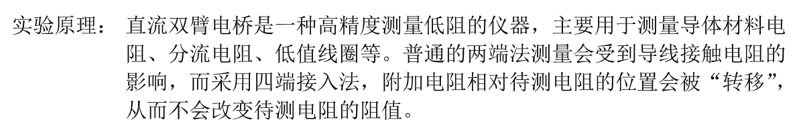

## ZJU-Template-of-Physics-Experiments

这是一个 ZJUers 大学物理实验/普通物理学实验报告模版，用 ```typst``` 语言完成，旨在使得公式编辑等更加简便，也旨在给不愿意用 WORD 的同学一个选择。

## 环境配置

想要使用本模版，请自学 typst 的基本语法，并有一个本地的 typst 环境。（如 VSCode 中安装 typst 相关插件，如 [Typst](https://marketplace.visualstudio.com/items?itemName=clysto.typst), [Tinymist Typst](https://marketplace.visualstudio.com/items?itemName=myriad-dreamin.tinymist), [Typst Math](https://marketplace.visualstudio.com/items?itemName=surv.typst-math). 具体有哪些等待后续维护时添加）当然可以在 [官网](https://typst.app) 线上编辑，不过需要将图片、字体等资源上传到网页。

另外，推荐创建 python 虚拟环境安装需要的py库（除非你知道自己要下载什么），具体操作如下：

- 本地有```Python```，在克隆到本地的仓库下创建 Python 虚拟环境
  - 分别运行```python -m venv <yourvenvname>```与```source <yourvenvname>/bin/activate```, 其中```<yourvenvname>```为自定义虚拟环境名
- 运行```pip install -r requirements.txt```

## 使用

>注：学习陌生的知识最重要的是 **“模仿”**

下面是本模版一些部分的解释：

---

```typst
#show: project.with(
  type: "shiyan", //报告类型，"shiyan"表示实验报告，"yuxi"表示预习报告
  experiment: "双臂电桥测低值电阻", //实验名称
  table: "1", //实验桌号
  teacher: "某老师", //指导教师
  class: "某班", //班级
  author: "xxx", //姓名
  school_id: "324010xxxx", //学号
  date: "2025年3月xx日", //日期
  day: "星期四上午", //星期*上/下午
)
```

这是本报告的一些参数（主要体现在封面），具体内容如注释所示

---

```typst
#header(tag: "1")
```

这是标题的简化表达，具体每个```tag```对应的标题在```template.typ```中，其标号和 “物理实验报告模版” 的标号是一致的。对于预习报告，这些```header```不全需要，只需保留```tag: "1.1"```到```tag: "1.3"```即可。

---

```typst
#table(
  columns: (auto, auto),
  align: left,
  stroke: none,
  [实验原理：],
  [直流双臂电桥是一种……],
)
```

这是一个伪 enumerate （LaTeX语法块）的 typst 代码，效果如下：



要修改内容只要修改两个 ```[]``` 内容即可；同理也可继续添加偶数个```[]```，以添加更多的项。

---

```typst
#grid(
  columns: (auto,auto),
  image("./images/experiment1.png",width: 8cm),
  image("./images/experiment2.png", width: 8cm)
)
```

这是一个并排插入图片的代码块。

---

```typst
#[
  #set enum(numbering: "(1)")
  + 双臂电桥测量低电阻的原理与使用方法。
  + 单臂电桥和双臂电桥的关系和区别。
  + 双臂电桥测量低电阻时能够消除或大大减小附加电阻对测量结果的影响的原因。
]
```

这是一个简单的有序列表，序号为```(1)(2)(3)```，仿照已有代码写即可。

---

其他部分可以通过操作自行探索。

附：这里的模版其实也可用于预习报告，自行注释相关部分即可。

## 绘图

仓库下还有一个```match.py```，其用于绘制拟合图像，其中的物理量和数据都是样例的数据，使用时请自行修改（同时修改图例），在python环境下运行即可。

## 导出

对于最后的导出，从 typst 文件导出 PDF 是非常容易的（且转换效率很高，基本所见即所得），但是从 PDF 转到 WORD/docx 文档则可能会有损失。目前最优的转换途径为使用 WPS 将 PDF 转为 docx，但即便如此，在项目测试时出现过公式转换受损的情况。得出的结论暂为输入不止一个公式可解决该问题，后续维护时也会给出更具体的解决方案。

## Others

本仓库~~非常~~不完善，欢迎贡献和PR ~
